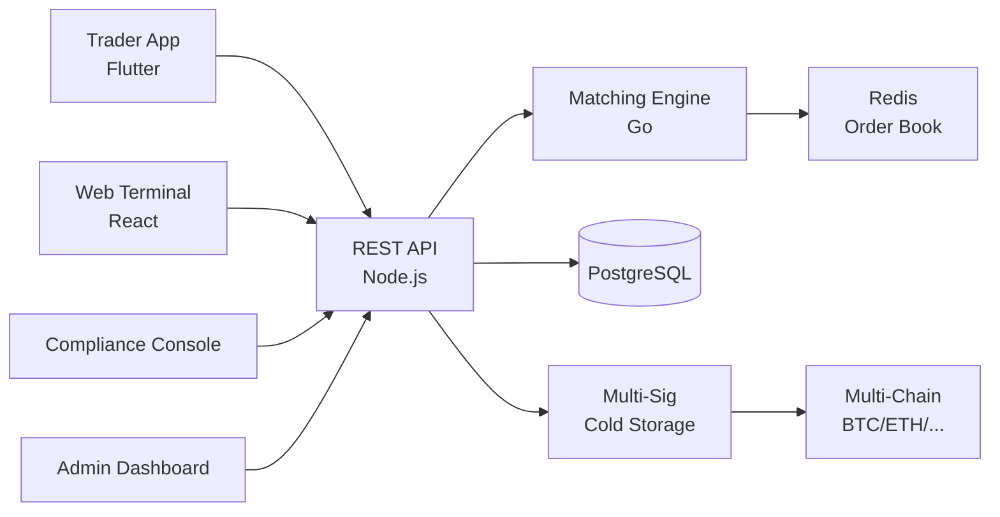

# Paxful Clone — White-Label Cryptocurrency Exchange Platform by Miracuves

**MXP2P** is a production-ready, white-label Paxful clone: a complete crypto-exchange platform with spot/futures, KYC/AML, and admin controls — delivered with **100% source code ownership** in **6 working days**.

> 💰 **See it running before you talk to anyone.** Live trader app, web terminal, and admin console — demo credentials are printed on the [solution page](https://miracuves.com/paxful-clone#demo). No sales call required.

---

## 🚀 Live Demos

| Environment | URL | What you can test |
|---|---|---|
| 📱 Trader App | [mas.mimeld.com](https://mas.mimeld.com) | Spot, futures, wallet, orders — mobile trading |
| 🌐 Web Terminal | [mxp2p.mimeld.com](https://mxp2p.mimeld.com) | Pro-grade chart, order book, depth, trades |
| 🛡️ Compliance Console | [Solution page → Demo](https://miracuves.com/paxful-clone#demo) | KYC/AML, transaction monitoring, SARs |
| 🛠️ Admin Dashboard | [Solution page → Demo](https://miracuves.com/paxful-clone#demo) | Pairs, liquidity, fees, security, analytics |

Demo credentials for all environments: **[miracuves.com/paxful-clone → Demo section](https://miracuves.com/paxful-clone/#demo)**

---

## ✨ What Makes This Paxful Clone Different

Most exchange scripts stop at "spot trading." This platform ships with the features that actually run a regulated trading *business*:

- **Matching Engine Performance** — 1M+ orders/sec matching engine with deterministic latency — same architecture Binance and Coinbase use for pro tiers
- **Multi-Jurisdiction Compliance** — jurisdiction-aware KYC (Fiat-to-Crypto-NO-KYC, Crypto-to-Crypto, EU MiCA, US MSB) with same codebase
- **Layer-2 Native** — Arbitrum, Optimism, Polygon, Base integrated out of the box — including bridges and gas optimization
- **Cold-Wallet Treasury** — native copy-trading marketplace, grid bots, DCA bots, and arbitrage bots — Binance's fastest-growing revenue line
- **Fiat On/Off-Ramps** — 80+ fiat on-ramps via SEPA, ACH, SWIFT, UPI, IMPS — same ramp providers Binance and Coinbase use

## 📦 Core Features

**Trader:** spot trading · limit/market/stop orders · futures & margin · staking & earn · wallet · P2P · order book · advanced charts · API keys

**Compliance:** KYC/AML with ID + biometric · transaction monitoring · sanctions screening · SAR/CTF reporting · jurisdiction-aware controls

**Admin:** pairs & liquidity · fee tiers · token listings · withdrawal approvals · security audits · analytics & reporting

## 🏗️ Architecture

**Stack:** Node.js backend for low-latency · Go for matching engine · React for web · React Native / Flutter for apps · PostgreSQL for audit · TimescaleDB for trades · Redis for caching · 80+ fiat on-ramps via SEPA, ACH, SWIFT, UPI, IMPS, payment processors

## 📋 What’s Included

- ✅ Full source code — backend, web, mobile apps, panels (no encryption, no license locks)
- ✅ Deployment to your servers & app store submission assistance
- ✅ Your branding — white-label rename, logo, colors, domain
- ✅ 60 days post-launch support + 12 months of free updates
- ✅ Documentation & handover

**Pricing:** from **$2,899**, transparent on the [solution page](https://miracuves.com/paxful-clone/#pricing) — no "contact us for quote" games.

## 🆚 Why Not Build From Scratch?

Custom crypto exchanges run $200k–$1.5M and 8–18 months. A proven white-label base gets you to market in 6 working days for a fraction of that, with your budget preserved for legal, compliance, and market-maker partnerships.

## 📚 Resources

- 📖 [Paxful Clone — Full Solution Page](https://miracuves.com/paxful-clone) (features, pricing, demos, FAQ)
- 💰 [How Much Does a Crypto Exchange Cost in 2026?](https://miracuves.com/paxful-clone#pricing) pricing breakdown & what's included
- 📝 [Best Paxful Clone Script in 2026](https://miracuves.com/paxful-clone/blog/) features, pricing & launch guide
- 🧠 [Matching Engine Architecture for Crypto Exchanges](https://miracuves.com/paxful-clone/blog/) 1M+ orders/sec, latency, fairness
- ✅ [Miracuves Facts & Claims Ledger](https://miracuves.com/paxful-clone/facts/) every claim we make, verified

## 🏢 About Miracuves

[Miracuves Solutions](https://miracuves.com) builds white-label clone apps and custom software from Mumbai, India — 90+ ready-made solutions, live demos for every product, transparent pricing, and delivery in 6 working days. Operating since 2010.

**Talk to us:** [WhatsApp](https://wa.me/919830009649) · [Schedule a consultation](https://miracuves.com/schedule-consultation/) · [miracuves.com](https://miracuves.com)

---

### ⚠️ Note on This Repository

This repository is a product overview. The full source code is delivered to clients on purchase — see [what’s included](https://miracuves.com/paxful-clone/#included). For a hands-on evaluation, use the live demos above; credentials are public on the solution page.

*Keywords: paxful clone, paxful clone script, crypto exchange, cryptocurrency exchange, white label crypto, trading platform, spot futures, Flutter crypto app, Node.js exchange*

---

<!--
══════════════════════════════════════════════════
TEMPLATE VARIABLE KEY — auto-generated from Netflix-Clone pattern
══════════════════════════════════════════════════
{APP_NAME}        Paxful Clone
{MX_NAME}         MXP2P
{CATEGORY}        Cryptocurrency Exchange Platform
{DEMO_WEB}        mxp2p.mimeld.com
{PRICE}           $2,899
{SLUG}            paxful-clone
{SOLUTION_URL}    https://miracuves.com/paxful-clone/
{VERTICAL}        crypto_exchange

See /tmp/verticals/crypto_exchange.txt for the vertical config used to generate this README.
══════════════════════════════════════════════════
-->